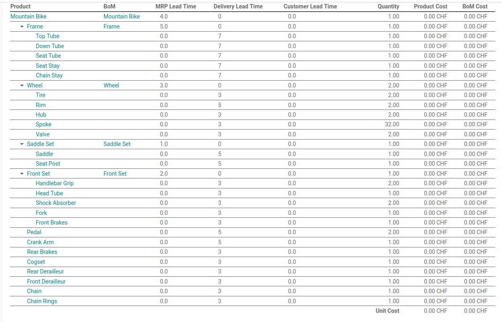

# Demand-Planner

Get order proposals for multi-level sub-products.

## Test Data

The test data set contains a manufacturing setup for a mountain bike. The product is assembled from manufactured and purchased parts.


**BoM**

This is the bill of material with lead times:



## Import Sequence

Import csv files from demo folder.

1. Navigate to *Contacts* and import `res.partner.csv`
2. Navigate to *Manufacturing > Products > Product Variants* and import `product.product.csv`
3. Navigate to *Purchase > Configuration > Vendor Pricelists* and import `product.supplierinfo.csv`
4. Navigate to *Manufacturing > Products > Bills of Materials* and import `mrp.bom.csv`

### Export Templates

When exporting models use these fields and save as csv file.

**product.product**

```
Name
Product Type
Cost
Manufacturing Lead Time
Customer Lead Time
Routes
```

**mrp.bom**

```
Product
Quantity
BoM Type
BoM Lines/Component
BoM Lines/Quantity
```

**product.supplierinfo**

```
Vendor
Product Template
Quantity
Price
Delivery Lead Time
```

**res.partner**

```
Name
Is a Company
```
