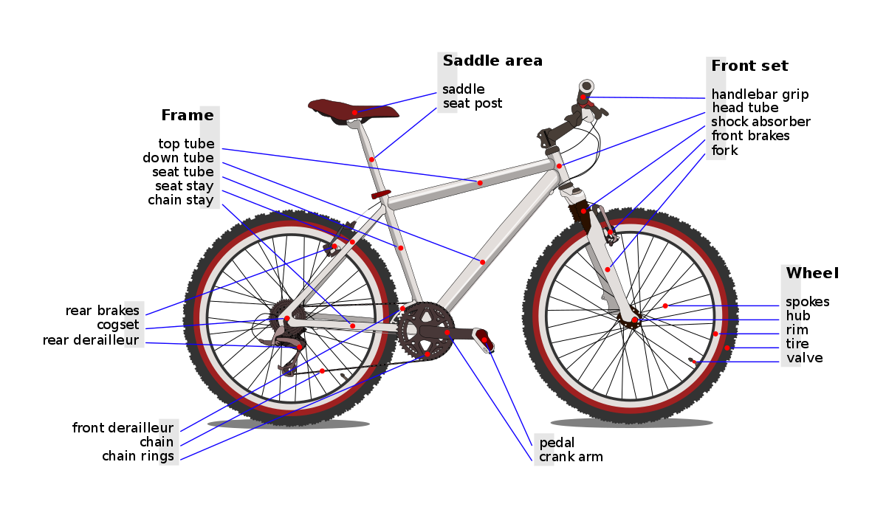
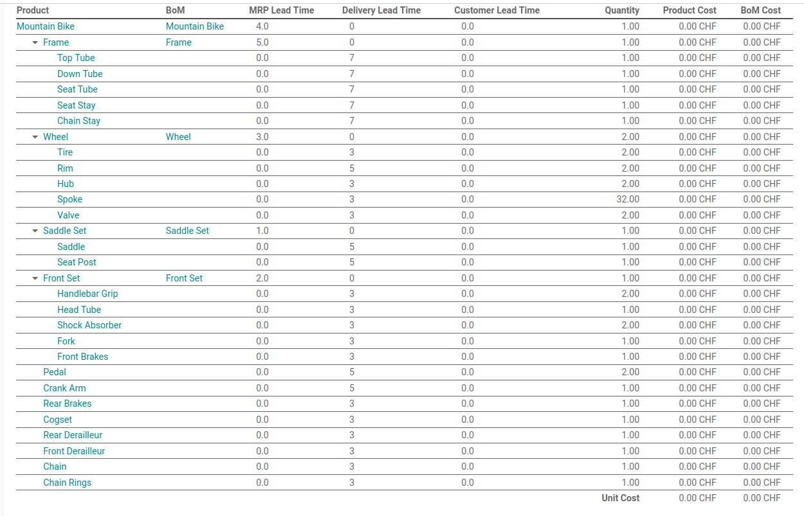
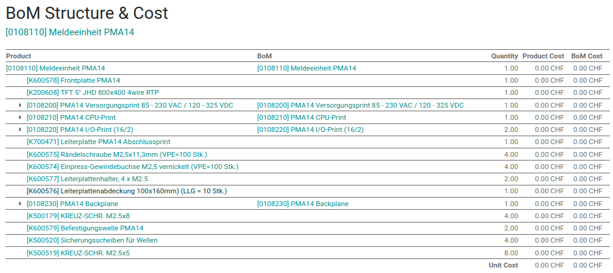

# Demand Planner

Get order proposals for multi-level sub-products.

## Test Data

The test data set contains a manufacturing setup for two products. These products are assembled from manufactured and purchased parts.

### Mountain Bike

This is fictional product for testing puproses only.



**BoM**

This is the bill of material with lead times:



### Meldeeinheit PMA14

This is a real product from the customer.



## Import Sequence

Import csv files from the `test_data` folder.

1. Navigate to *Contacts* and import `res.partner.csv`
2. Navigate to *Manufacturing > Products > Product Variants* and import `product.product.csv`
3. Navigate to *Purchase > Configuration > Vendor Pricelists* and import `product.supplierinfo.csv`
4. Navigate to *Manufacturing > Products > Bills of Materials* and import `mrp.bom.csv`

### Export Templates

When exporting models use these fields and save as csv file.

**product.product**

```
id
name
standard_price
produce_delay
sale_delay
route_ids/id
```

**mrp.bom**

```
id
product_tmpl_id/id
product_qty
type
```

**mrp.bom.line**

```
id
bom_id/id
product_id/id
product_qty
```

**product.supplierinfo**

```
id
name/id
product_tmpl_id/id
min_qty
price
delay
```

**res.partner**

```
id
name
is_company
```
